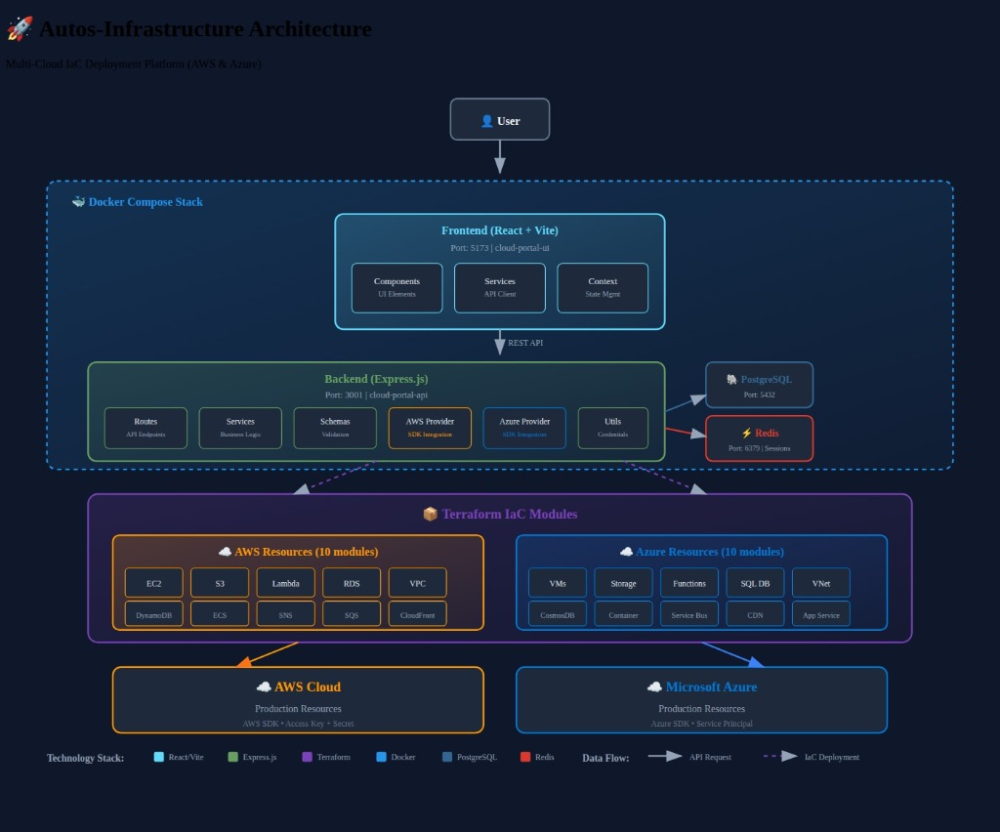
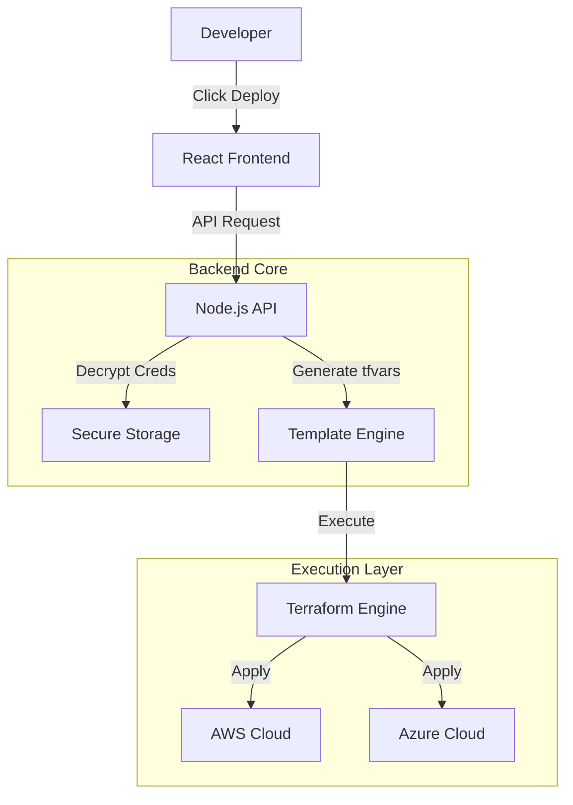

# Autos Infrastructure Portal

**Democratizing Cloud Infrastructure with One-Click Deployments.**

---

## 🎯 Project Goals

1.  **Democratize Infrastructure**: Remove the steep learning curve of Terraform and Cloud Consoles. Allow any developer to provision production-grade resources.
2.  **Accelerate R&D**: Reduce the time to spin up proof-of-concept environments from hours to seconds.
3.  **Standardize Patterns**: Enforce infrastructure best practices (tagging, security groups, encryption) automatically via pre-defined templates.
4.  **Hybrid Cloud Competency**: Provide a consistent learning and operational platform for both AWS and Azure.

---

## 🏗️ Architecture

The system abstracts the complexity of cloud APIs and Terraform state management behind a user-friendly API.

### Design Principles

- **Stateless Operation**: The portal acts as a pass-through orchestrator, leveraging Terraform for state management.
- **Secure Handling**: Credentials are never exposed to the client side after entry; they are encrypted and stored in the secure vault.
- **Modular Templates**: Each resource is defined as an independent Terraform module, allowing individual versioning and updates.

---

## ✨ Features

- **Unified Cloud Dashboard**: Deploy to AWS & Azure from a single pane of glass.
- **Catalog of 20+ Resources**: Pre-configured templates for EC2, S3, RDS, Azure VMs, CosmosDB, and more.
- **Zero-Touch Provisioning**: Automatic handling of networking (VPC/VNet) and security.
- **Instant Access**: SSH keys and connection strings generated and delivered instantly.

---

## 🛠 Tech Stack

| Layer        | Technology                     |
| :----------- | :----------------------------- |
| **Frontend** | React 18, Vite 5, Tailwind CSS |
| **Backend**  | Node.js 18+, Express.js        |
| **IaC**      | Terraform                      |
| **Database** | PostgreSQL 16                  |

---

## 📄 License

MIT License. Open source for educational and enterprise learning purposes.
