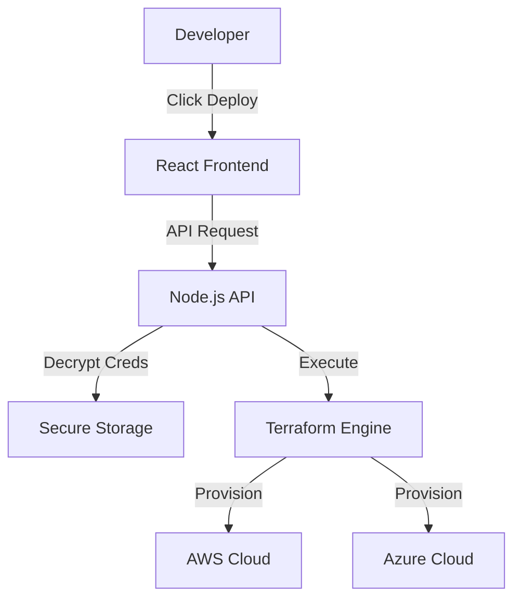

# Autos Infrastructure Portal

<div align="center">


**Democratizing Cloud Infrastructure with One-Click Deployments.**
A unified portal for deploying secure, compliant resources across AWS and Azure without writing a single line of Terraform.

[Features](#-features) • [Quick Start](#-quick-start) • [Architecture](#-architecture)

</div>

---

## 🎯 Mission

To bridge the gap between complex Infrastructure as Code (IaC) and developer autonomy. This portal provides a **Self-Service Interface** for teams to spin up standardized resources (VMs, Databases, Serverless Functions) instantly.

---

## ✨ Key Features

### 🚀 Unified Cloud Dashboard

- **AWS & Azure Support**: Deploy to multiple clouds from a single pane of glass.
- **Catalog of 20+ Resources**: Pre-configured templates for EC2, S3, RDS, Azure VMs, CosmosDB, and more.
- **Zero-Touch Provisioning**: Automatic handling of VPCs, Subnets, and Security Groups behind the scenes.

### ⚡ Developer Experience

- **One-Click Deploy**: Select a resource, configure basic parameters, and launch.
- **Instant Access**: SSH keys and connection strings are generated and securely delivered immediately.
- **No Terraform Knowledge Required**: We handle the state and complexity; you get the infrastructure.

### 🛡️ Enterprise Grade

- **Secure Backend**: Credentials encrypted at rest using industry-standard AES-256.
- **Validation**: Active pre-flight checks ensure cloud credentials are valid before deployment begins.
- **Modern Stack**: Built with React (Vite), Node.js, and Terraform.

---

## 🏗️ Architecture

The system abstracts the complexity of cloud APIs and Terraform state management.



---

## 🚀 Quick Start

### Prerequisites

- Node.js 18+
- Docker (optional for containerized run)
- Terraform CLI (if running locally without Docker)

### Local Setup

1.  **Backend Setup**

    ```bash
    cd backend
    cp .env.example .env
    npm install
    npm run dev
    ```

2.  **Frontend Setup**

    ```bash
    cd frontend
    npm install
    npm run dev
    ```

3.  Access the portal at `http://localhost:5173`

---

## 📦 Supported Catalog

| Category      | AWS Resources                  | Azure Resources                              |
| :------------ | :----------------------------- | :------------------------------------------- |
| **Compute**   | EC2 Instances, Lambda, ECS     | Virtual Machines, Function Apps, App Service |
| **Storage**   | S3 Buckets, EBS                | Storage Accounts, Blob Storage               |
| **Database**  | RDS (Postgres/MySQL), DynamoDB | SQL Database, CosmosDB                       |
| **Messaging** | SNS, SQS                       | Service Bus                                  |
| **Network**   | VPC, CloudFront                | Virtual Networks, CDN                        |

---

## 📚 For Developers

This project serves as a comprehensive reference for:

- **Full-Stack Cloud Integration**: Connecting React to AWS/Azure SDKs.
- **Terraform Automation**: patterns for programmatic Terraform execution.
- **Secure Systems Design**: Handling sensitive cloud credentials in a web app.

---

## 📄 License

MIT License. Open source for educational and enterprise learning purposes.
